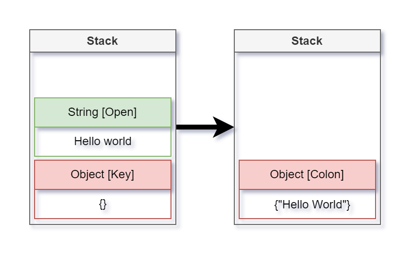

# over-thinking

一些算法笔记，以及随手写的小玩具


## Json解析器

使用栈和有限状态机实现的`json`解析器，不使用递归所以不受`json`结构深度的影响，且解析时每次只读取一个字符，不需要对数据源随机读写，适用于内存受限的场景。

### 算法描述

从一个案例开始:

```json
\n {
    "abc": [true, \t null, {}, x] \t
} "hello world"
```

首先`json`的类型只能是`null, object, array, string, true, false, number`之中的一种，而拿到一个`json`的时候并不能确定它是什么类型的，所以一开始假定当前json的类型为`unknown`。

如果当前类型为`unknown`，那么读到的第一个字符就可以指明这个`json`的类型，当然会跳过一些空白符，如`' ', '\t', '\n', '\r'`，这里有以下设定

|       开始字符        | 推断类型  |
| :-------------------: | :-------: |
|           {           |  Object   |
|           [           |   Array   |
|           "           |  String   |
|       -， digit       |  Number   |
|           n           |   Null    |
|           t           |   True    |
|           f           |   False   |
| ' ', '\r', '\t', '\n' |  Unknown  |
|         other         | Exception |

当前`json`有了具体的类型，接下来读取的字符就会进入到对应类型的解析逻辑中，这些类型从解析方法上可以分为两类：第一种是容器类型，即类型可以嵌套包含其他类型，如`object`和`array`；第二种是普通类型，不能嵌套其他类型的类型。


**栈与状态机**

为了解析包含嵌套结构的数据类型，引入了栈的概念，当未开始进行解析的时候，栈中有一个元素且类型为`unknown`，表示当前`json`中有一个未知元素，当解析到第一个非空字符`{`，可以推断当前`json`的类型为`object`，于是将当前栈顶的元素类型修改为`object`，从第二个字符开始，进入解析`object`的逻辑，这里列出解析`object`的状态

| 当前状态 |  次级状态  |
| :------: | :--------: |
|    键    | 冒号，结束 |
|   冒号   |     值     |
|    值    | 逗号，结束 |
|   逗号   |     键     |
|   结束   |    结束    |

解析`object`的默认状态为**键**，即当前如果读到一个非空字符，那么这个字符只能是`"`或者`}`, 其余情况视为异常。



如果读取的是一个字符串，那么会将一个字符串类型的元素压到栈顶，当字符串解析完成后，首先将栈顶的值保存，然后将栈顶弹出栈，最后将字符串的值传递到当前的栈顶，即`object`。而`object`会根据当前的状态来将值插入键或者值，比如当前状态为*键*，即传入的值会保存到键中，然后当前状态转换为*冒号*，即下一个非空字符必须是冒号。

暂时写到这里。

